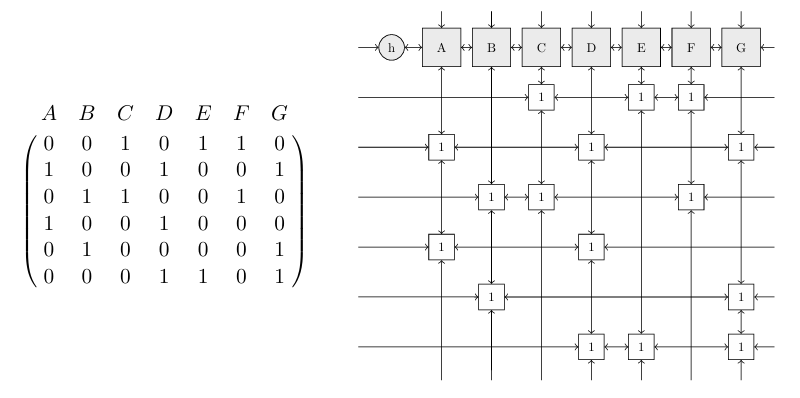

Link trò chơi: https://comga999ms.github.io/master-sudoku/

## Intro
Thông thường khi nói về trò chơi sudoku thì đại đa số mọi người sẽ nghĩ ngay đến việc chơi với ma trận 9x9 và với kích thước này thì rất dễ dàng giải được bài toán bằng thuật Backtracking với thời gian cũng khá nhanh khoảng ~100ms cho một bảng 9x9. Nhưng nếu mở rộng bảng ra 16x16, 25x25 thì sao? Lúc này thuật toán chạy khá lâu ~10s cho 16x16, > 1 phút với bảng 25x25. Vậy nên ở bài viết này mình sẽ trình bày cách giải bài toán trên tối ưu thời gian hơn bằng thuật toán Dancing Links.

Trước khi giải được bài toán trên thì chúng ta cần tìm hiểu về 2 bài toán khác có liên quan mật thiết để giải đó là Exact Cover và Dancing Links.

## Exact Cover Problem 
### **Phát biểu bài toán**
- Tập hợp $X$ (gồm các phần tử cần được phủ).
- Họ các tập con $S = \{S_1, S_2, \dots, S_k\}$, với mỗi $S_i \subseteq X$.

**Yêu cầu**: Tìm một **phủ chính xác** $S^* \subseteq S$ thỏa mãn:
1. **Tính rời rạc**:  Các tập trong $S^*$ đôi một không giao nhau
   $\forall S_i, S_j \in S^* \ (i \neq j): S_i \cap S_j = \emptyset$.  
2. **Tính phủ toàn bộ**:  Hợp của các tập trong $S^*$ bằng $X$
   $\bigcup_{S_i \in S^*} S_i = X$.  
→ Mỗi phần tử $x \in X$ xuất hiện **đúng một lần** trong $S^*$.
### **Điều kiện cần để tồn tại phủ**
- **Điều kiện phủ**:   Hợp của tất cả các tập con phải bằng tập mẹ ban đầu. Nếu không thỏa, bài toán vô nghiệm do thiếu phần tử. $\bigcup_{S_i \in S} S_i = X$.  
- **Tập rỗng**:  Nếu $\emptyset \in S$, nó có thể bị loại khỏi $S^*$ vì không ảnh hưởng đến phủ.

**Ví dụ**
- Tập hợp $X = \{1, 2, 3, 4, 5, 6, 7\}$
- Họ tập con $S = \{A, B, C, D, E, F\}$ với:
  - $A = \{1, 4, 7\}$
  - $B = \{1, 4\}$
  - $C = \{4, 5, 7\}$
  - $D = \{3, 5, 6\}$
  - $E = \{2, 3, 6, 7\}$
  - $F = \{2, 7\}$

$S^* = \{B, D, F\}$ là nghiệm duy nhất, vì:

  - $B \cap D = \emptyset$, $B \cap F = \emptyset$, $D \cap F = \emptyset$ 
  - $B \cup D \cup F = \{1,4\} \cup \{3,5,6\} \cup \{2,7\} = X$ 

### Ma Trận Giao (Incidence Matrix)
Bài toán được biểu diễn bằng ma trận nhị phân với:

- **Hàng**: Tương ứng với các tập con trong $S$
- **Cột**: Tương ứng với các phần tử trong $X$
- **Giá trị**:
  - 1 nếu tập con chứa phần tử
  - 0 nếu không chứa

**Ví dụ:** Cho $X = \{1, 2, 3, 4, 5, 6, 7\}$ và $S = \{A, B, C, D, E, F\}$, ma trận giao là:

    
|    | 1 | 2 | 3 | 4 | 5 | 6 | 7 |
|----|---|---|---|---|---|---|---|
| **A** | 1 | 0 | 0 | 1 | 0 | 0 | 1 |
| **B** | 1 | 0 | 0 | 1 | 0 | 0 | 0 |
| **C** | 0 | 0 | 0 | 1 | 1 | 0 | 1 |
| **D** | 0 | 0 | 1 | 0 | 1 | 1 | 0 |
| **E** | 0 | 1 | 1 | 0 | 0 | 1 | 1 |
| **F** | 0 | 1 | 0 | 0 | 0 | 0 | 1 |

Chọn các hàng $B$, $D$, $F$ mỗi cột có chính xác một số 1, thỏa mãn bao phủ chính xác.
## Sudoku problem from "Exact Cover" perspective
Đầu tiên ta sẽ bắt đầu với bảng 9x9 trước. Sau đó sẽ làm tương tự với các bảng to hơn.
### Tổng quan
Đối với bảng 9x9 Sudoku có các ràng buộc sau:

- Mỗi hàng chứa các số từ 1 đến 9 không trùng lặp. 
- Mỗi cột chứa các số từ 1 đến 9 không trùng lặp.
- Mỗi ô vuông con 3×3 chứa các số từ 1 đến 9 không trùng lặp.

→ Bài toán này có thể chuyển đổi thành bài toán Exact Cover (phủ chính xác) bằng cách mô hình hóa các ràng buộc thành tập hợp các phần tử cần phủ và các tập con khả thi.

### Mô Hình Hóa Bài Toán
Gồm 4 nhóm ràng buộc (tổng cộng $81 * 4 = 324$ phẩn tử)
- Đảm bảo mọi ô trống $(i, j)$ phải được điền một số từ 1 đến 9.
- Hàng thứ $i$ phải được điền đủ các số từ 1 đến 9 .
- Cột thứ $j$ phải được điền đủ các số từ 1 đến 9.
- Ma trận con 3x3 phải được điền đủ các số từ 1 đến 9.

-> Mỗi lựa chọn là điền số $k$ vào ô $(i, j)$ tương ứng với 1 tập con gồm 4 ràng buộc: 
$$
S_{(i,j,k)} = \{(p_{i,j}), (r_i, k), (c_j, k), (b_m, k)\}
$$
**Ví dụ:** Giả sử điền số $5$ vào ô $(2, 3)$ -> Tập con: $\{(p_{2,3}), (r_2, 5), (c_3, 5), (b_1, 5)\}$

### Ma Trận Giao (Incidence Matrix)
Chúng ta sẽ biến bài toán Sudoku thành một ma trận lớn, trong đó:
- 729 hàng: Mỗi hàng ứng với 1 cách điền số (9 số × 9 hàng × 9 cột)
- 324 cột: 4 loại ràng buộc × 81 (9×9) mỗi loại

Mỗi hàng có đúng 4 số 1 ở các cột tương ứng với:

- Ô $(i,j)$ được điền.
- Hàng $i$ có số $k$.
- Cột $j$ có số $k$.
- Ô vuông 3x3 có số $k$.

**Ví dụ**:
| Lựa chọn          | p₁₁ | r₁₁ | c₁₁ | b₁₁ | ... | p₂₃ | r₂₅ | c₃₅ | b₁₅ | ... |
|-------------------|-----|-----|-----|-----|-----|-----|-----|-----|-----|-----|
| **Điền 1 vào (1,1)** | 1   | 1   | 1   | 1   | ...   | 0   | 0   | 0   | 0   | ... |
| **Điền 5 vào (2,3)** | 0   | 0   | 0   | 0   | ... | 1   | 1   | 1   | 1   | ... |

Bài toán sẽ có nghiệm khi và chỉ khi mỗi cột có chính xác một số 1.

**Nhận xét**: Nhìn vào bảng thực tế thì bảng có rất nhiều số 0 trên bảng do mỗi hàng chỉ có 4 số 1. 
## Dancing Links (DLX)
DLX (Dancing Links with Algorithm X) là một thuật toán hiệu quả để giải các bài toán phủ tập chính xác, đặc biệt là bài toán Sudoku, Pentominoes, và các bài toán khác.

### Mô hình 
Thuật toán DLX sử dụng cấu trúc dữ liệu danh sách liên kết 4 chiều (left, right, up, down) để biểu diễn ma trận 0-1:

- **Node**: 
    - Mỗi node có 4 liên kết: left, right, up, down
    - Mỗi node thuộc về một cột (column header)
    - Các column header có thêm thông tin size (số node trong cột)
- **Cấu trúc chính**:
    - Header node (root) liên kết đến các column header
    - Mỗi column header đại diện cho một ràng buộc cần được thỏa mãn
    - Mỗi node đại diện cho một phần tử 1 trong ma trận

### Giải thuật

Các bước giải thuật của thuật toán Dacing Links
- Chọn cột có ít số 1 nhất.
- Nếu không còn cột → Tìm thấy nghiệm.
- Với mỗi hàng chứa 1 ở cột đã chọn:
    - Thêm vào nghiệm.
    - Che tất cả cột & hàng xung đột (tức là loại các cột có cùng vị trí số 1).
    - Đệ quy giải bài toán con.
    - Nếu thành công → trả nghiệm.
    - Bỏ che (backtrack) nếu thất bại.
